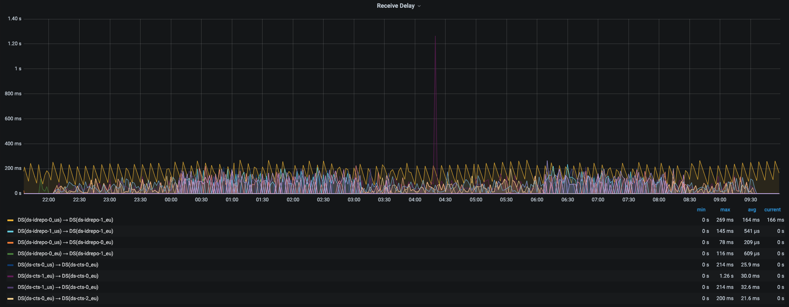

# Multi-cluster deployment for DS on GKE using Cloud DNS for GKE

# **`Cloud DNS for GKE is currently in Preview.`**

Doc: https://cloud.google.com/kubernetes-engine/docs/how-to/cloud-dns#enabling_scope_dns_in_a_new_cluster  

## Overview
This guide explains how to deploy DS across 2 different GKE clusters, using one cluster in the US and one cluster in Europe.
For different cluster names, just replace *eu* and *us* in the various files mentioned in the setup steps below .

> To deploy the full ForgeRock Identity Platform across multiple clusters using Multi-cluster Ingress and Cloud DNS for GKE, go straight to this [readme](https://github.com/ForgeRock/forgeops/blob/master/etc/multi-cluster/google-cloud/multi-cluster-ingress/README.md).

There are 4 major steps:
* Configure 2 clusters to use Cloud DNS with one in the US and one in Europe.
* Prepare kustomize configuration to ensure unique server IDs and configure bootstrap servers.
* Deploy DS.
* Verify replication is working.

## Step 1: Prepare clusters
#
Provision 2 clusters with following requirements:
  * Same VPC
  * In different regions if multi-region(below example is configured in eu and us)
  * Create same namespace in each cluster for DS (default: prod).
  * Configure your Cloud DNS domain name(see below) 

Create your cluster as described in the forgeops docs but also include the following arguments where cluster domain will be the domain configured for that cluster e.g. the following will replace pod domain `.cluster.local` with `.us` for the us cluster:
```bash
  --cluster-dns clouddns \
  --cluster-dns-scope vpc \
  --cluster-dns-domain us
```

Edit the [multi-cluster.sh](https://github.com/ForgeRock/forgeops/blob/release/7.2.0/cluster/gke/multi-cluster.sh) file with your cluster spec including required values for:
* CLOUD_DNS_DOMAIN
* REGION

Then run the following commands:  
```bash
source cluster/gke/multi-cluster.sh
cluster/gke/cluster-up.sh
```

## Step 2: Prepare Deployment  
#  

>Currently these files are configured based on eu and us regions. These values must match the value provided for `--cluster-dns-domain`  names registered in step 1.

Change the DS_GROUP_ID and DS_BOOTSTRAP_REPLICATION_SERVERS env vars for a different list of regional identifiers.

See the env section in the `ds-idrepo.yaml` and `ds-cts.yaml` in kustomize/overlay/multi-cluster/clouddns/eu and kustomize/overlay/multi-cluster/clouddns/us.  

For example:
```yaml
    env:
    - name: "DS_GROUP_ID"
      value: "eu"
    - name: "DS_BOOTSTRAP_REPLICATION_SERVERS"
      value: "ds-cts-0.ds-cts.prod.svc.eu:8989,ds-cts-0.ds-cts.prod.svc.us:8989"
```

>`NOTE:` Ensure that the bootstrap servers include a ds instance from each cluster.

<br />

## Step 3: Deploy
#  

Deploy DS to EU cluster
```bash
eupath=$(bin/config path kustomize overlay multi-cluster/eu) # `/bin/config path` command will get the full path
forgeops install --custom $eupath -n prod base ds
```

Both deployments must use the same secrets.  Run the following command to copy the secrets between clusters:
```bash
# --source-cluster and --dest-cluster need to match the cluster context names
bin/copy-secrets --source-cluster eu --source-ns prod --dest-cluster us --dest-ns prod
```

Deploy DS to US cluster
```bash
uspath=$(bin/config path kustomize overlay multi-cluster/us) # `/bin/config path` command will get the full path
forgeops install --custom $uspath -n prod base ds
```  

## Step 4: Verify replication
#  

The best way to check replication is using Grafana.  This can be deployed as part of the Prometheus Operator Helm chart package using our sample script:

```bash
bin/prometheus-deploy.sh
```

Connect to Grafana:

```bash
kubectl port-forward $(kubectl get  pods --selector="app.kubernetes.io/name=grafana" --field-selector status.phase=Running --output=jsonpath="{.items..metadata.name}" --namespace=$NAMESPACE) $PORT:3000 --namespace=$NAMESPACE
```

Then type `localhost:3000` in your browser to view Grafana.

Go to the ForgeRock Directory Services dashboard and look at the receive delay graph to confirm that ds pods in each cluster are receiving traffic from each other.



If traffic isn't replicating between clusters, then revisit the steps in this readme and check the Google Cloud documentation described [here](https://cloud.google.com/kubernetes-engine/docs/how-to/cloud-dns)


## Step 5: Delete
#  

In each cluster run:
```bash
# Add --force to remove secrets and pvcs
forgeops delete
# To retain the idrepo pvcs if you want to hold on to the users
kubectl delete pvc data-ds-cts-0 data-ds-cts-1 data-ds-cts-2
```

Cleanup:
* Delete clusters.
